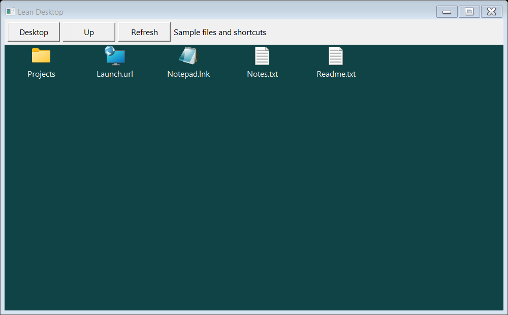
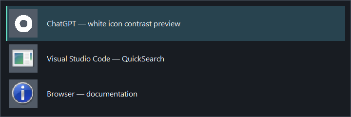
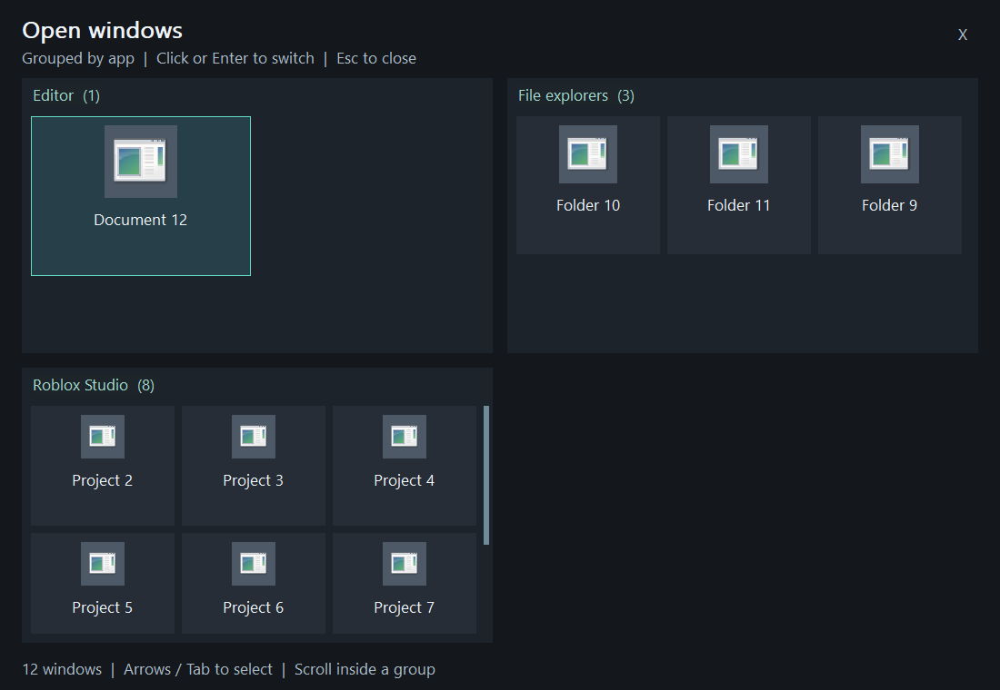
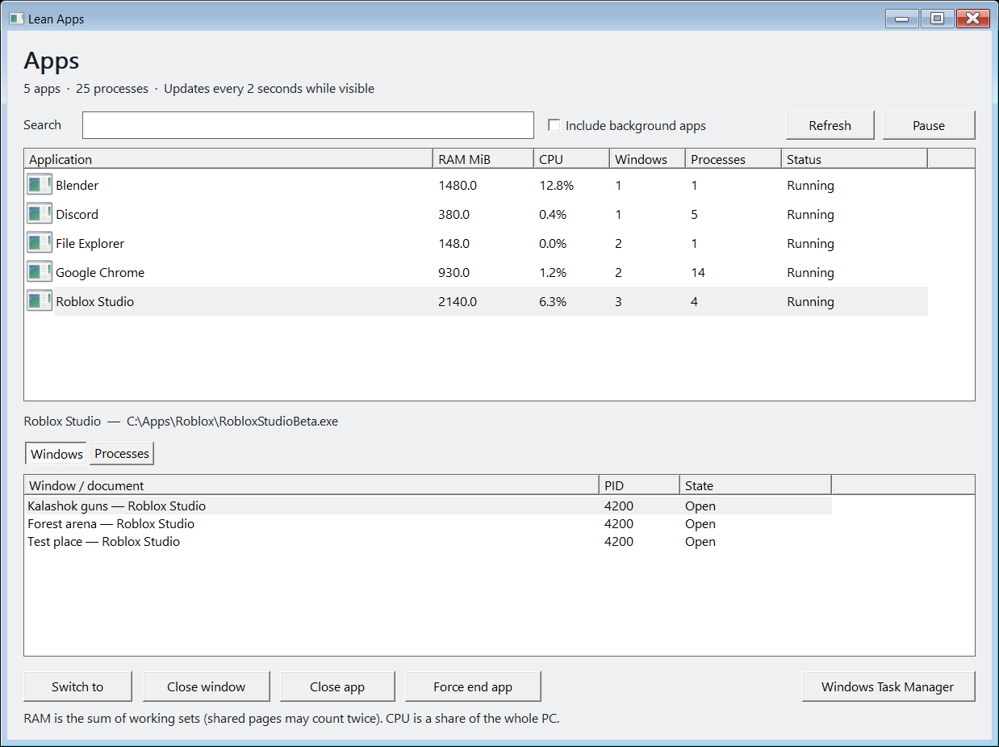
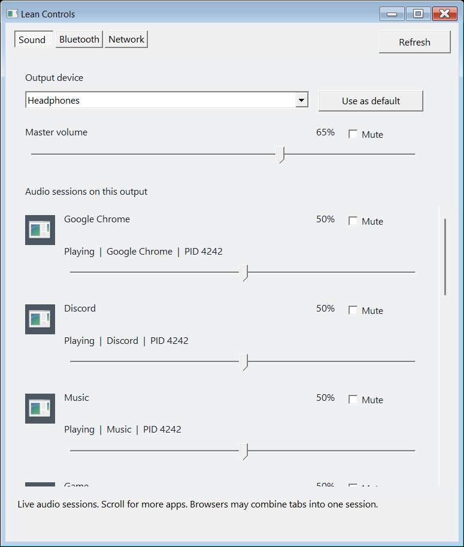
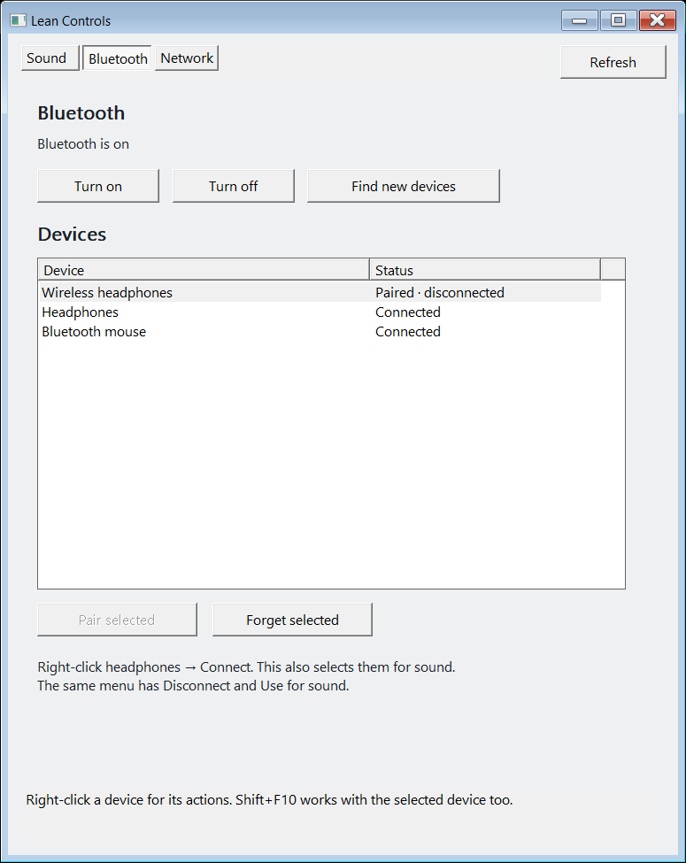

# Lean Desktop

A small, native Windows desktop and taskbar, paired with the QuickSearch launcher.

LeanBar is written in C++ using Win32 controls and GDI. QuickSearch is a C# WinForms companion. There is no browser renderer, thumbnail generator, or continuous window-list polling. Window events drive taskbar updates; the clock updates once per minute. Desktop icons load in the background using Windows' shared icon cache.

**Experimental, Windows 11 x64, primary monitor only.** Start with the preview. This is a smaller feature set than Explorer, not a complete replacement for every Windows shell integration.



## Features

- Task buttons with switching, minimize, close, active-window indication, and overflow.
- Desktop files, folders, application shortcuts, and URL/file-type icons.
- Basic folder navigation without opening Explorer. Filesystem notifications refresh desktop and folder listings automatically; F5 remains available.
- Win+D to show the desktop and return to the previous window.
- QuickSearch app/command launcher, Windows-key access, and screenshots.
- Large Alt+Tab switcher with 48px icons and contrast for white icons.
- Win+Tab overview with large window titles and separate application groups, including Roblox Studio and file explorers. Icons adapt from 64px to 48px or 32px as a group fills up; titles stay the same readable size. No animations or live thumbnails.
- Native on-demand sound mixer, Bluetooth device controls, and Wi-Fi connections.
- Lean Apps: app groups with combined CPU/RAM, document windows, search, and close/force-end controls.
- A recovery process that restores Explorer if the main desktop process crashes.
- Optional sign-in startup plus Start Lean Desktop and Restore Windows shortcuts.



The Win+Tab overview is a fullscreen native canvas inside the taskbar process. Each application gets its own panel; overflowing panels scroll independently, while the overall board stays fixed. Exceptionally many app groups use additional board pages (PageUp/PageDown or the footer arrows). It creates its window and icon list only while open and displays document/project titles. It paints in response to input and window events, with no thumbnail connections, screenshot capture, or animation loop.



## App manager

Open **App manager** from the taskbar context menu, press **Ctrl+Alt+Esc**, or search for **Lean Apps** in QuickSearch. **Ctrl+Shift+Esc** continues to open Windows Task Manager.

Lean Apps shows one row per executable installation, combining its processes and related windowless helpers from the same installation directory. Choose an app to see its individual window/document titles, such as each Roblox Studio project. The **Processes** tab exposes the exact processes included in that app's totals. Separately opened applications and child programs in unrelated directories retain their own groups; identical filenames in different installations are not merged.

- Search by app, document/window title, process path, or PID. Click a column heading to sort by RAM, CPU, window count, or process count.
- **Switch to** activates the selected window. **Close window** closes only that window; **Close app** asks all windows in the selected app group to close normally, allowing save prompts. Some apps continue running in the background after their windows close.
- **Force end app** confirms before terminating the currently listed eligible processes in that group. It can lose unsaved work across all that app's windows. Each process is checked again by PID, creation time, executable path, owner, and critical status. Exited processes are skipped; newly spawned processes are not silently added to a confirmed operation.
- **Include background apps** reveals user apps without visible windows. Windows background infrastructure and other users' processes remain in Windows Task Manager. Lean Desktop's shell processes and critical/Windows processes cannot be force-ended here.

The panel is a separate native C++ Win32 executable, with no web renderer, kernel driver, service, or administrator requirement. A background worker samples every two seconds while the window is open and not minimized. **Pause** stops sampling; closing the window ends the process. App icons are cached while open, and refresh preserves the selected app/window and scroll position. No automatic process termination or priority changes occur.

RAM is summed working-set memory in MiB, so shared pages can be counted more than once. CPU is normalized to the whole PC and needs two samples; it is not a per-window or per-browser-tab estimate. Incomplete memory data uses `~`, and unavailable/not-yet-sampled CPU uses `...`. Application groups are a convenience view, not a replacement for detailed system diagnostics or exact ownership of every brokered/helper process.



## Sound, Bluetooth, and Wi-Fi

Use the **Sound**, **Bluetooth**, and **Wi-Fi** buttons on the taskbar. These open `LeanControls.exe`, a separate C++ Win32 application. It uses Windows device APIs directly, without Explorer, Windows Settings, React, WebView, or Electron. Closing it ends the process; it has no background service.

The mixer uses a document/project title when the audio session's process owns one distinct window title. Window events keep that title current. If the process owns multiple windows, or is a browser audio subprocess, it keeps the app/session name because Windows cannot reliably attribute the audio to one document or tab. The second line includes the app name and process ID.

- **Sound:** **Playing through** identifies Windows' default playback device. Choose a device in the list to view its mixer, then click **Play through this** to make it the default for media and calls. The list distinguishes the current output, available devices, and disconnected or disabled devices. Fixed output/master controls sit above a scrolling list of audio sessions, with app icons, playing/idle status, volume sliders and mute. Core Audio events update new sessions and external volume changes without polling. Apps appear once they have created an audio session on the selected output. Multiple sessions from one app appear separately; browser tabs can only be separated when the browser exposes separate Windows audio sessions. Apps with their own output settings may need those changed separately. Closing the panel ends its listener thread too.
- **Bluetooth:** right-click the headphones in the device list and choose **Connect**. This reconnects their audio if needed and makes them the sound output for playback and calls. The same menu has **Disconnect**, **Use for sound**, **Pair**, and **Forget device**; Shift+F10 opens it for the selected row. The separate audio picker is gone. Device rows show connection/playback status, and audio endpoints are matched by Windows container IDs rather than similar names. Radio controls, an eight-second discovery scan, and PIN/confirmation pairing remain available. Windows may show its required pairing-consent dialog. Reconnection requires a compatible driver and checks the resulting audio endpoint state.
- **Network:** list Wi-Fi adapters and nearby networks, scan, connect/disconnect, and turn Wi-Fi on/off. Saved profiles use Windows credentials. New open, WPA2-Personal/AES and WPA3-Personal networks use a native password prompt; Windows stores the profile, and the app writes no password files or logs. Enterprise, legacy-security and hidden networks need a preconfigured profile. Wired networking remains managed by Windows; this panel does not edit Ethernet, DNS, proxy, or VPN settings.





Bluetooth audio reconnection uses the documented [Bluetooth audio kernel-streaming properties](https://learn.microsoft.com/en-us/windows-hardware/drivers/audio/kspropsetid-btaudio), rather than disabling/reinstalling drivers. Support depends on the installed driver. Default-output selection uses an isolated private Windows COM interface because Core Audio does not expose a public setter; future Windows builds may break that optional button. Failures are reported without registry changes.

Recent Windows versions may require location permission for nearby Wi-Fi enumeration. If Windows denies it, the panel still lists saved profiles. No permissions are bypassed. Hardware enumeration and an isolated test-session volume round trip passed on the development PC. New-device pairing and switching live network/audio connections still require testing with the intended hardware.

## Build

Use Windows x64 with Visual Studio 2022 or compatible Build Tools, the **Desktop development with C++** workload, and the Windows SDK. The companion uses Windows' .NET Framework compiler; it does not need NuGet packages.

```bat
build.cmd
```

The runnable package is written to `build\bin`. `build.cmd` finds the installed C++ tools through `vswhere`, or uses an existing developer command prompt. All four executables are built locally; no software is downloaded by the build. LeanControls uses the C++/WinRT headers supplied with a current Windows SDK.

## Try without stopping Explorer

From `build\bin`:

```bat
LeanBar.exe --desktop-preview --companion
```

This displays the desktop in a normal window and previews the taskbar above the existing Windows taskbar. Exit before trying another mode; only one LeanBar UI instance runs per session.

```bat
LeanBar.exe --replace --companion
```

This hides the original taskbar while retaining Explorer. It does **not** deliver the memory saving of stopping Explorer. Exit to restore the original taskbar.

## Full desktop takeover and startup

**Current prerequisite:** `HKLM\SOFTWARE\Microsoft\Windows NT\CurrentVersion\Winlogon\AutoRestartShell` must already be a DWORD set to `0`. This is a machine-wide setting that disables Explorer's automatic crash restart. The installer checks it and refuses to proceed otherwise; it does not change it. This experimental release does not automatically configure an untouched Windows installation for shell takeover.

Close Explorer file operations and save work before takeover. From a regular, non-administrator PowerShell session in `build\bin`:

```powershell
powershell -NoProfile -ExecutionPolicy Bypass -File .\Install.ps1 -StartNow
```

The installer:

1. Copies the package to the current user's Documents\LeanBar folder.
2. Backs up an existing QuickSearch startup shortcut, if present.
3. Creates a task named `LeanBar Desktop - <username>` for that user's sign-in, delayed by eight seconds.
4. Runs the task interactively at normal priority, without administrator privileges, on battery or AC, with no execution time limit.
5. Starts the native desktop, recovery guard, and companion before stopping the current session's Explorer shell.

The Windows boot shell remains Explorer. If our executable is missing or fails before takeover, the ordinary Windows interface remains available. The startup PowerShell script exits after launching; it is not a resident supervisor. Desktop paths use Windows known folders, including redirected folders.

Work-area updates send an asynchronous settings notification so a stalled application cannot hold up that notification during startup or recovery. Showing or hiding Explorer's taskbar also uses the asynchronous window API.

The full installer is intended to run outside an MSIX-packaged terminal/app: AppData and Startup-folder virtualization can otherwise produce misleading file visibility. The scheduled launcher handles the actual Startup folder outside that package context.

The original development installation successfully ran its sign-in command repeatedly, including after a deliberate crash test. **A physical reboot was not tested.**

## Controls

| Action | Control |
|---|---|
| Launcher | Win alone, Win+S, Ctrl+Esc, or QuickSearch button |
| Clear the search input | Ctrl+Backspace |
| Switch input language / keyboard layout | Win+Space; Win+Shift+Space cycles backward |
| Show desktop / return | Win+D; Ctrl+Alt+D is also available |
| Switch windows | Alt+Tab; Shift+Alt+Tab reverses direction |
| Grouped window overview | Win+Tab, or taskbar context menu: Window overview |
| App manager | Ctrl+Alt+Esc, QuickSearch: Lean Apps, or taskbar context menu: App manager |
| Full Windows Task Manager | Ctrl+Shift+Esc |
| Within the overview | Click / Enter to activate; arrows / Tab to select; wheel over an app group to scroll it; Esc / Win+Tab to close |
| Desktop folder navigation | Double-click / Enter, Up button / Backspace |
| Refresh files and icons | F5 or Refresh |
| Window actions | Right-click a task button |
| Screenshots | Print Screen or Win+Shift+S through QuickSearch |
| Session recovery | Taskbar context menu: Exit and restore |

## Restore Windows

Double-click **Restore Windows** on the desktop or run `Restore Windows.cmd`. This removes the sign-in task, restores the original QuickSearch startup shortcut, closes our interface, and starts Explorer. Installed files and backups are retained.

**Start Lean Desktop** can start the replacement manually again. It does not recreate a removed sign-in task; rerun the installer to enable automatic startup again.

If the interface is unavailable, Ctrl+Shift+Esc opens Task Manager; its Run new task action can run `explorer.exe` or the installed `Restore.ps1` script. The guard cannot recover the desktop if both the main process and guard are terminated together.

Restoration preserves the prerequisite `AutoRestartShell=0` configuration. Returning Windows to its standard automatic shell-crash recovery requires a separate administrator change back to `1`.

## Scope and limitations

- Primary monitor only; this is not a multi-monitor shell.
- Existing desktop files stay in their original locations.
- No notification-area icon hosting, notification center, Recycle Bin, drag/drop, rename/delete UI, jump lists, or Explorer shell extensions.
- Folder lists are limited to 4,096 visible entries. Change notifications watch the current folder, or both user and public Desktop folders, without recursively watching their contents. Selection is preserved across automatic refreshes. F5 is available if a filesystem does not support notifications.
- The overview groups ordinary application windows on the current desktop. It does not create virtual desktops. Protected/elevated windows can limit window metadata or keyboard-hook access.
- URLs use configured/cached icons where available, otherwise their associated browser/file-type icon. There is no favicon downloader.
- Some Store apps, Windows shortcuts, and shell integrations expect Explorer. Opening such a feature may restart it. LeanBar does not continuously kill Explorer or ongoing file operations.
- The companion's global keyboard hook is inherited from QuickSearch; its behavior can be affected by elevated apps and security software. Do not disable antivirus protections to run the project.
- The keyboard hook runs on its own message thread so UI/icon work cannot block it. Modifier state is reconciled after missed key releases; the hook is periodically renewed when no Win/Alt key is held.
- Win+Space cycles installed keyboard layouts for the focused app, without an Explorer popup or changes to the configured language list. Each Space press advances once. Apps can reject a layout-change request; elevated apps may require their own language shortcut because of Windows message permissions.

## Resource measurements

One development-machine snapshot after adding real icons measured roughly **33.4 MiB** working set for the desktop/taskbar, **7.7 MiB** for the recovery process, and **64.8 MiB** for QuickSearch. Explorer had measured approximately **226–444 MiB** at different points in that session, in addition to the original launcher.

These are observations from different moments, not a controlled benchmark. Working-set sums double-count shared pages. The reduced feature set matters, and no FPS or total-system speed improvement has been established. Closing unused browser tabs and development sessions can save substantially more memory than changing the shell.

## Tests

```powershell
powershell -NoProfile -ExecutionPolicy Bypass -File .\tests\run.ps1
```

Tests cover task filtering, overflow bounds, native desktop controls, automatic create/rename/hide/delete refreshes, selection preservation, folder navigation, asynchronous icon resolution, overview grouping/scrolling/cleanup, exact-process mixer naming, and crash recovery using **test-owned fixture windows**. A separate process deliberately stalls on settings notifications to verify that the work-area notification and icon lookup return promptly. This test applies the existing work-area rectangle without changing its size; run it in an ordinary interactive desktop session, since restricted sandboxes may deny that Windows API. Tests do not stop your Explorer shell or install startup settings. Test images use synthetic sample files and icons.

The three native controls panels are also rendered with sample data and checked for blank images. The mixer render verifies that scrolling moves app rows while the master controls stay fixed, viewing another mixer does not switch playback, the explicit output button switches the simulated default, and disconnected outputs cannot be selected for playback. Bluetooth checks cover connected/disconnected context-menu states, non-audio devices, and rejecting same-name devices with different container IDs. For a separate hardware check, run `LeanControls.exe --probe report.txt`; its local report includes paired-device names and matching audio-endpoint counts. For live mixer event tests, use `LeanControls.exe --test-live-sound report.txt`: it verifies that a new isolated session appears automatically, external volume/mute events update its controls, and its slider writes back correctly. These tests only change a dedicated test session, never another app's volume, pairing, radios, network connections, or default output. Reports are local and should not be committed.

App-manager tests cover aggregation, separate installations, parent PID reuse, resource sampling, and normal/forced closure of disposable test-owned processes. They never close the user's applications. The synthetic UI render also checks sorting, project-title filtering, selection preservation, detail tabs, and disabling actions when the selected app exits. Keyboard-layout tests cycle only a test-owned window through the installed layouts and restore its initial layout.

## Project layout

Controls rendering tests also switch repeatedly between Sound, Bluetooth, and Network, checking that old controls are destroyed and the selected panel is repainted.

- `LeanBar.cpp`: native taskbar, takeover lifecycle, recovery guard, launcher IPC.
- `Desktop.h`: native desktop, navigation, asynchronous system icons.
- `Overview.h`, `WindowNames.h`: grouped icon overview and process/window identity helpers.
- `LeanControls.cpp`, `ControlsAudio.h`, `ControlsWireless.h`: native sound, Bluetooth and Wi-Fi UI and device access.
- `LeanApps.cpp`, `AppModel.h`: on-demand app manager, resource sampling, grouping, and verified process actions.
- `QuickSearch.Companion.cs`: app launcher, larger switcher, screenshot handling, Win+D fallback.
- `Install.ps1`, `StartSession.ps1`, `Restore.ps1`: installation, startup, rollback.
- `tests/`: native integration tests and switcher rendering fixture.

QuickSearch was developed earlier with Claude and adapted into this companion. The native desktop/taskbar and integration were developed with Codex. Local conversation histories, machine inventories, account identifiers, and installation state are not part of this repository.
